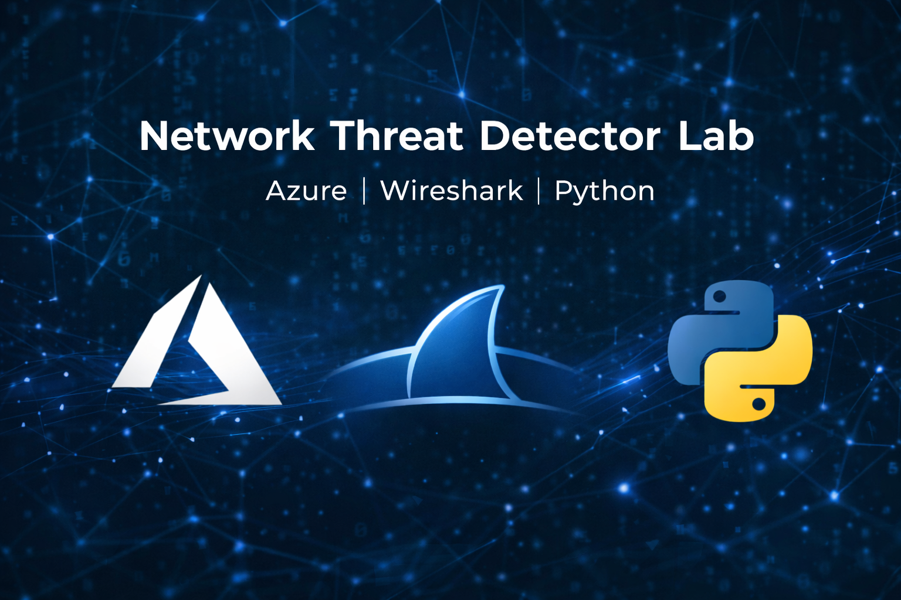

  

<h1 align="center">🛡️ Network Threat Detector Lab</h1>

Azure • Wireshark • Python • Scapy

---

## 📌 Overview

This project simulates real-world network traffic in a cloud environment, captures it, analyzes it, and detects suspicious behavior using Python.

It demonstrates a full SOC-style workflow:

* Generate traffic
* Capture packets
* Analyze in Wireshark
* Detect anomalies using Python

---

## 🧱 Lab Setup

### ☁️ Azure Virtual Machine

### 🌐 Networking Configuration

### 🔐 NSG Inbound Rules

---

## 💻 System Access

### 🖥️ Linux Access & Network Info

### 🔑 SSH Connection

---

## 📡 Traffic Generation

### 📶 ICMP Traffic (Ping)

### ⚠️ Simulated Suspicious Traffic

---

## 📦 Packet Capture

### 📥 tcpdump Installed

### 🎥 Capturing Traffic

### 💾 PCAP File Created

### 🔄 Download to Local Machine

---

## 🔍 Wireshark Analysis

### 📶 ICMP Analysis

### 🌐 HTTP Analysis

---

## 🧠 Python Threat Detection

### ⚙️ Scapy Setup

### 🚨 Detection Output

---

## ⚙️ Detection Logic

The Python script analyzes packet capture data and identifies:

* **Top Talkers** (most active IP addresses)
* **High-frequency HTTP requests**
* **Potential port scanning behavior**

---

## 🧰 Tools Used

* Microsoft Azure
* Ubuntu Linux
* tcpdump
* Wireshark
* Python
* Scapy

---

## 🎯 Skills Demonstrated

* Cloud infrastructure deployment
* Network traffic analysis
* Packet capture and inspection
* Detection engineering fundamentals
* Python scripting for cybersecurity
* Threat pattern recognition

---

## 🚀 Conclusion

This project demonstrates a complete end-to-end network analysis and detection workflow, closely aligned with real-world SOC analyst responsibilities.

---
